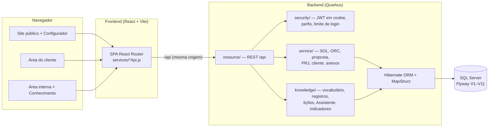
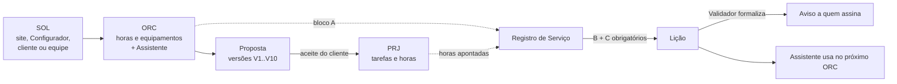

# Documentação técnica — Plataforma do Centro de Excelência em Metrologia SENAI · ZEISS

Documento técnico do desafio "Plataforma Web para o Laboratório de Metrologia do SENAI" (processo seletivo para o intercâmbio ZEISS Alemanha) e do complemento "Módulo de Gestão do Conhecimento em Orçamentação".

Leitura complementar:

- [`README.md`](../README.md): como executar, acessos e instruções de uso.
- [`knowledge-module.md`](knowledge-module.md): módulo de conhecimento, vocabulário controlado, mapeamento das telas no ciclo e roteiro de demonstração.
- [`semente-real.md`](semente-real.md): registro da semente real (entrevistas e serviços recuperados).

---

## 1. Objetivo da solução

Dar ao Centro de Excelência em Metrologia (Faculdade SENAI Ítalo Bologna, Goiânia) um canal digital completo com a indústria:

1. **Apresentar** o Centro, seus serviços e sua infraestrutura (site institucional em 6 idiomas).
2. **Receber solicitações** bem descritas, pelo formulário de orçamento ou pelo Configurador on-line, que já sugere a tecnologia mais adequada.
3. **Acompanhar** cada atendimento de ponta a ponta: solicitação (SOL) → orçamento (ORC) → proposta versionada → projeto (PRJ), com área do cliente e área interna.
4. **Aprender com cada orçamento**: registrar o que foi orçado, o que foi realizado e o que se aprendeu, e devolver esse conhecimento na hora de orçar (Módulo de Gestão do Conhecimento).

## 2. Visão geral dos módulos

| Módulo | Público | O que resolve |
| --- | --- | --- |
| Site institucional (`/`, `/sobre`, `/servicos`, `/equipamentos`) | Visitante | Quem somos, missão, visão, trajetória, parceiros, infraestrutura, catálogo de serviços, equipamentos com dados técnicos, localização e contato (rodapé). |
| Solicitação de orçamento (`/orcamento`) | Visitante / cliente | Formulário guiado (empresa, responsável, e-mail, telefone, serviço, necessidade, peças, anexos). |
| **Configurador on-line** (`/configurador`) | Visitante / cliente | Diferencial: o cliente descreve peça e requisitos e recebe a tecnologia recomendada com a aderência de cada equipamento. Gera a SOL já com a "configuração técnica". |
| **Comparador de equipamentos** (`/equipamentos#comparador`) | Visitante | Diferencial: 2 ou 3 máquinas lado a lado. As linhas comparáveis fazem as mesmas perguntas a todas (princípio, contato, interior, onde acontece, tamanho, detalhe, entrega, indicação, serviços), e a ficha do fabricante aparece abaixo. A seleção fica no endereço (`?comparar=prismo,atos-q`) e pode ser compartilhada. Sem notas ou pontuações inventadas. |
| **Área do cliente** (`/cliente`) | Cliente | Diferencial: acompanhamento das solicitações, propostas (PDF, aceite ou recusa), projetos, documentos e dados da conta. |
| Área interna (`/portal`) | Equipe | SOL → ORC → Proposal Builder → PRJ, tarefas delegadas com apontamento de horas, quadro da equipe, custos de equipamentos, configurações e auditoria. |
| **Gestão do Conhecimento** (`/portal/conhecimento`) | Equipe | Registro de Serviço (blocos A/B/C), vocabulário controlado, indicadores, Assistente de Orçamento, validação de lições e avisos por assinatura. |

## 3. Arquitetura



- **Duas camadas independentes**, como pede o DS-059: frontend (visão) e backend (serviços), ligados só pela API REST em `/api`.
- **Mesma origem**: em desenvolvimento, o Vite encaminha `/api` ao Quarkus. Em produção, NGINX ou Ingress roteiam `/` para o frontend e `/api` para o backend. Por isso não há CORS habilitado.
- **Autenticação**:
  - o backend emite um JWT assinado (RS256) em cookie `HttpOnly` + `SameSite=Strict`;
  - são dois cookies separados: `lab_session` para a equipe e `lab_customer` para clientes;
  - o JavaScript nunca lê o token, e nada fica em localStorage ou sessionStorage.
- **Autorização em duas camadas**:
  - políticas HTTP do Quarkus por caminho, por exemplo SOL/ORC/Administração só para o perfil Administrador;
  - regras dentro dos serviços (`CurrentUser.requireAtLeast`), com perfis cumulativos: Consulta < Técnico < Validador < Administrador.
- **Banco**: SQL Server com schema versionado pelo Flyway. O Hibernate só valida (`schema-management.strategy=validate`), assim nenhuma alteração de tabela acontece fora de uma migration revisada.

### Fluxo principal



## 4. Tecnologias e justificativas

| Camada | Tecnologia | Por quê |
| --- | --- | --- |
| Frontend | React 19 + JavaScript (sem TypeScript) | Padrão DS-059 (React, somente JavaScript). React 19 é a versão com suporte ativo. |
| Build frontend | Vite + Yarn | Yarn é o gerenciador exigido. O Vite dá recarga instantânea e build estático, que o NGINX serve sem runtime Node. |
| Estilo | Tailwind CSS | Identidade visual consistente sem biblioteca de componentes externa e sem CDN. |
| Animação | motion (Framer Motion) | Transições do site institucional com respeito ao scroll. |
| PDF | @react-pdf/renderer | Proposta comercial gerada no navegador a partir do snapshot aprovado. |
| Backend | Java 21 + Quarkus 3 | Quarkus é o framework do padrão (1.12 ou superior). O Quarkus 3 exige Java 17 ou mais, e o 21 é a LTS atual. Sobe rápido e usa pouca memória, o que ajuda em contêiner. |
| Persistência | Hibernate ORM + Flyway | Hibernate é o ORM do padrão. O Flyway versiona o schema (V1–V11) e aplica as migrations na subida. |
| DTOs | MapStruct | Mapeamento entidade ↔ DTO gerado em tempo de compilação (padrão DS-059). |
| Segurança | SmallRye JWT, PBKDF2-SHA256 | JWT do Quarkus (padrão). O hash de senha usa só o JDK (sem dependência extra), com contagem de iterações recomendada pela OWASP. |
| Banco | SQL Server 2019+ | Exigido pelo padrão. O Docker Compose sobe uma instância para desenvolvimento. |
| Testes | JUnit 5, Quarkus Test, REST Assured; `node --test` no frontend | Testes de unidade, de API contra banco isolado (`lab_platform_test`) e de regressão do frontend. |

### Aderência ao padrão DS-059 (GETIN/FIEG)

| Item do padrão | Situação |
| --- | --- |
| Frontend e backend em camadas separadas | Atende. |
| Camadas conteinerizadas / Kubernetes + Ingress | Parcial. O backend tem `Dockerfile` (build Maven multi-stage) e a API usa um único contexto `/api`, pronto para Ingress. Dockerfile do frontend (NGINX) e manifestos Kubernetes estão em melhorias futuras. |
| SQL Server 2019+ | Atende. |
| Java / JDK 11 | Diferente, por necessidade. Java 21 LTS, porque o Quarkus 3 exige Java 17 ou mais. |
| Maven 3.6+, Quarkus, Hibernate, MapStruct | Atende. |
| CORS somente no próprio domínio | Atende: CORS desabilitado, frontend e API na mesma origem. |
| Autenticação JWT via Quarkus | Atende (SmallRye JWT). A integração OIDC com o AD corporativo é uma melhoria futura. |
| Cache Redis ou MongoDB | Não utilizado. Com uma instância e consultas leves, o cache não se justificava. O limite de login foi escrito para migrar ao Redis quando houver várias réplicas. |
| JavaScript sem TypeScript, Yarn, sem CDN | Atende. Exceção consciente: o mapa de localização é um `iframe` do Google Maps. |
| JWT sem localStorage/sessionStorage | Atende (cookie HttpOnly). O localStorage guarda só o idioma escolhido. |
| Compatível com proxy reverso NGINX | Atende: `quarkus.http.proxy.proxy-address-forwarding=true` e API em caminho único. |
| OWASP Top 10 | Parcial. Ver seção 8. |

## 5. Organização do projeto

```
lab-platform/
├── backend/                          Quarkus (Java 21, Maven)
│   ├── Dockerfile
│   ├── scripts/                      SQL de apoio (banco de teste, reset dos dados operacionais)
│   └── src/main/java/br/org/senai/lab/
│       ├── resource/                 endpoints REST (/api/...)
│       ├── service/                  regras de SOL, ORC, proposta, PRJ, tarefas, cliente, anexos, auditoria
│       ├── knowledge/                Gestão do Conhecimento (vocabulário, registros, lições, Assistente, indicadores, estatística)
│       ├── security/                 JWT em cookie, hash de senha, usuário atual, limite de tentativas de login
│       ├── entity/ dto/ mapper/ repository/ exception/
│   └── src/main/resources/db/migration/   V1–V11 (Flyway)
├── frontend/                         React + Vite (Yarn)
│   └── src/
│       ├── pages/                    públicas; customer/ (área do cliente); internal/ (portal) e internal/knowledge/
│       ├── components/               layout, home, about, configurator, quote, customer, internal, ui
│       ├── services/                 clientes da API (requestApi, quoteApi, projectApi, knowledgeApi, authApi…)
│       ├── data/                     catálogo de serviços e fichas técnicas dos equipamentos
│       ├── i18n/                     tradução da área pública (PT → EN, DE, ES, FR, IT)
│       └── utils/                    validação de contato, limites de anexos, datas
├── docs/                             esta documentação, o módulo de conhecimento e os registros de integração
├── private-data/                     fora do Git: carga dos serviços reais (dados de clientes)
└── docker-compose.yml                SQL Server de desenvolvimento
```

### Modelo de dados (migrations)

| Migration | Conteúdo |
| --- | --- |
| V1 | Solicitações (SOL), peças e histórico |
| V2 | Orçamentos (ORC), itens e propostas versionadas |
| V3–V4 | Projetos (PRJ), tarefas e histórico |
| V5 | Clientes (empresa e usuários) |
| V6 | Autenticação interna (perfis por cargo) |
| V7 | Gestão do Conhecimento: vocabulário, registros, lições, avisos, assinaturas |
| V8 | Identificação dos perfis pelo cargo; remoção das marcas de demo antigas |
| V9 | Tarefas com responsável, status e horas; apontamentos; marca `demo` em registros e lições |
| V10 | Snapshot do Configurador, configurações e auditoria administrativa |
| V11 | Anexos das solicitações |

## 6. Decisões técnicas

1. **Sessão só em cookie HttpOnly.** Nenhum token fica acessível ao JavaScript, o que protege contra roubo por XSS. `SameSite=Strict` reduz o risco de CSRF. Cookies de sessão do navegador: fechar o navegador encerra o acesso, e as telas de login sempre encerram a sessão anterior.
2. **Perfis cumulativos e bloqueio no servidor.** O menu só reflete o que o backend já impõe. Técnico e Validador veem apenas os PRJ com tarefas delegadas a eles e nunca recebem valores comerciais: o backend remove custo, valor e margem da resposta (`Km.hideCommercial` e a lista segura do PRJ).
3. **Concorrência otimista.** SOL, ORC, proposta e PRJ têm `revision`. Uma gravação com revisão antiga recebe 409 em vez de sobrescrever o trabalho de outra pessoa.
4. **Proposta como snapshot imutável.** Cada versão emitida guarda o snapshot comercial aprovado e o PDF. O servidor recompara o snapshot antes de emitir e rejeita se o ORC mudou. O limite é de 10 versões por proposta, com até 8 MB de PDF por versão, para o banco não crescer sem controle.
5. **O Assistente é estatístico e explicável, sem IA preditiva.** Usa mediana e quartis (não média), fator de correção igual à mediana de realizado ÷ orçado e a escada de confiança 0 / 1–4 / 5–14 / 15+. A lista de casos que geraram cada número sempre acompanha a recomendação. O servidor recalcula a recomendação ao registrar o bloco A, em vez de confiar no navegador.
6. **Regra central do complemento no servidor.** Um registro não fecha sem os blocos B e C, e o PRJ não é concluído sem o registro fechado (`lab.knowledge.require-record-on-project-completion`).
7. **Demonstração separada do real.**
   - Registros e lições têm a marca `demo`, que aparece com a etiqueta DEMO em toda tela.
   - Os indicadores reais ignoram esses registros; a demonstração é resumida num bloco à parte.
   - Uma única ação em Administração apaga tudo o que é demo, e o histórico real não é tocado.
8. **Vocabulário controlado editável.**
   - As classes (tipo de serviço, porte, material, complexidade, características, GD&T, recurso, causa de desvio) ficam no banco.
   - O Administrador mantém os termos pela tela, sem programador.
   - Nenhuma classificação aceita texto livre.
9. **Dados reais fora do repositório.** O cliente aparece nos registros apenas por código (`CLI-…`). A carga dos serviços reais e a planilha de custos ficam em `private-data/`, que está no `.gitignore`. O Git contém só código e o conjunto de demonstração.
10. **Anexos no banco, com limites.**
    - Arquivos das solicitações vão em `request_attachment` (VARBINARY).
    - Limites: 10 arquivos, 10 MB cada, 25 MB no total, extensões permitidas e tipo de mídia saneado.
    - O navegador avisa antes de enviar (`utils/fileLimits.js`) e o servidor garante (`AttachmentService`).
11. **Limite de tentativas de login.** 5 falhas por conta ou 20 por IP em 15 minutos resultam em bloqueio temporário (HTTP 429). O login bem-sucedido zera o contador da conta (`LoginAttemptGuard`).
12. **Tradução sem tocar nos componentes.** O português é a fonte. Um tradutor de DOM aplica o dicionário (PT → EN/DE/ES/FR/IT) aos textos renderizados, e o dicionário é carregado sob demanda.
13. **Auditoria.** Ações administrativas (configurações, perfis, dados de demonstração) e o histórico de SOL/ORC/PRJ registram quem fez e quando.
14. **Acabamento e acessibilidade.**
    - Cada página define o título da aba (`routes/DocumentTitle.jsx`), traduzido na área pública.
    - Endereços inexistentes caem numa página 404 com caminhos de volta.
    - Quem ativa "reduzir movimento" no sistema operacional não recebe animações de deslocamento (`MotionConfig reducedMotion="user"`), rolagem suave nem vídeos em reprodução automática.

## 7. Testes

| Onde | O que cobre | Como rodar |
| --- | --- | --- |
| `backend/src/test/.../knowledge/StatsTest` | Mediana e quartis, robustez a caso atípico, desvio e margem | `mvn test -Dtest=StatsTest` (não precisa de banco) |
| `.../knowledge/KnowledgeRulesTest` | Escada de confiança, tolerância, indicadores por tipo, **demo fora dos indicadores reais**, histórico vazio | `mvn test -Dtest=KnowledgeRulesTest` (não precisa de banco) |
| `.../security/LoginAttemptGuardTest` | Bloqueio após 5 falhas, liberação após a janela, reset no sucesso, limite por IP | `mvn test -Dtest=LoginAttemptGuardTest` |
| `.../knowledge/KnowledgeCycleTest` | **Roteiro da seção 7 automatizado**: Assistente honesto sem histórico → bloco A → fechamento acima do estimado (B + C) → só Validador formaliza → aviso a quem assina → recomendação muda → faixa com 5 casos e justificativa obrigatória → demo apagada sem afetar o real → valores comerciais ocultos para não administradores | `mvn test -Dtest=KnowledgeCycleTest` (usa `lab_platform_test`) |
| `backend/src/test/...ResourceTest` | Fluxos de SOL, ORC, proposta, PRJ, cliente e equipamentos | `mvn test` |
| `frontend/tests/*.test.mjs` | Regressões da API e das telas | `yarn test` |

O banco de teste é criado com `backend/scripts/create-test-database.sql`. `DatabaseIsolationResource` confirma que os testes nunca tocam o banco de desenvolvimento: compara uma impressão digital do DEV antes e depois.

## 8. Segurança (OWASP Top 10)

A versão atual é de demonstração. O que já existe e o que falta para produção:

| Risco | Situação |
| --- | --- |
| A01 Controle de acesso | Políticas HTTP por caminho + checagem de perfil nos serviços; valores comerciais removidos no servidor; cliente só acessa os próprios dados. |
| A02 Falhas criptográficas | JWT RS256; senhas PBKDF2-SHA256; cookie `Secure` configurável (`LAB_COOKIE_SECURE=true` em produção). **Pendente:** criptografar ou mascarar e-mail/telefone no banco (FO-307/FO-358) e usar chaves JWT fornecidas por variável de ambiente (as do repositório são só de DEV). |
| A03 Injeção | Consultas JPQL e nativas sempre parametrizadas; entrada validada nos serviços; React escapa a saída. |
| A04 Design inseguro | Regras de negócio no servidor (fechamento B + C, recomendação recalculada, snapshot da proposta). |
| A05 Configuração | Mensagens de erro genéricas (`UnhandledExceptionMapper`); CORS desabilitado. **Pendente:** cabeçalhos de segurança (CSP, HSTS) e páginas de erro no NGINX. |
| A07 Autenticação | Limite de tentativas de login; senha mínima de 8 caracteres; sessão encerrada ao voltar ao login. |
| A08 Integridade | Migrations versionadas; versões de proposta imutáveis. |
| A09 Registro e monitoramento | Auditoria administrativa e histórico por entidade. |

## 9. Principais desafios

- **Conhecimento verdadeiro sem histórico.** O complemento proíbe números inventados na base real. A solução combina três coisas:
  - a semente real, recuperada das propostas do laboratório;
  - a escada de confiança, com a qual o Assistente é útil desde o caso zero porque mostra o roteiro de estimativa;
  - uma demonstração separada e descartável.
- **Esconder valores sem duplicar telas.** Técnico e Validador usam as mesmas telas do Administrador. O backend remove os campos comerciais, e o frontend apenas não os exibe.
- **Consistência SOL → ORC → proposta → PRJ.** Revisões otimistas e snapshots evitam que uma alteração tardia do ORC mude uma proposta já enviada ao cliente.
- **Configurador que recomenda tecnologia.** Transformar requisitos (tolerância, tamanho, acesso interno, superfície) em aderência por equipamento, usando os dados técnicos das fichas ZEISS.
- **Site em 6 idiomas sem reescrever componentes.** Tradução por dicionário aplicada ao DOM.

## 10. Melhorias futuras

1. Dockerfile do frontend (NGINX), `docker-compose` completo e manifestos Kubernetes com Ingress (`/` e `/api`).
2. Login corporativo via Quarkus OIDC (AD do Sistema FIEG).
3. Criptografia de dados pessoais no banco, cabeçalhos de segurança e chaves JWT por segredo do cluster.
4. Redis para cache e para o limite de login compartilhado entre réplicas.
5. Backup diário criptografado do banco com retenção de 15 dias (FO-307).
6. Avisos por e-mail além do painel interno (o complemento marca como desejável).
7. Agenda de equipamentos e integração com o ERP, que ficaram fora do escopo por decisão do complemento.
